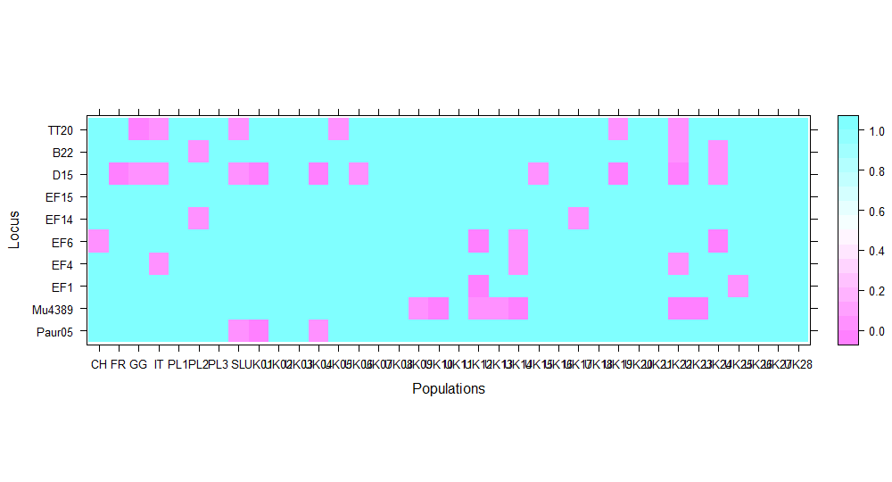
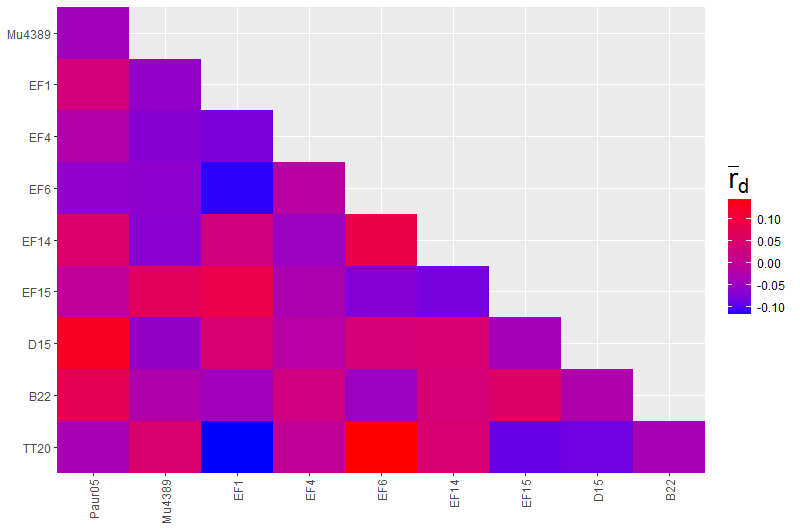
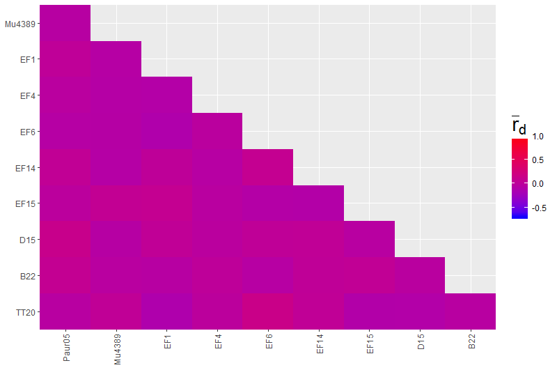

**Resumen de análisis y resultados**

# Population genetic structure of serotine bats (*Eptesicus serotinus*) across Europe

El conjunto de datos que se usó en este trabajo consiste en los genotipos de 10 microsatélites de 699 individuos de *Eptesicus serotinus*, pertenecientes a 36 poblaciones de Europa: 28 del Reino Unido y ocho de Europa continental.

Lo primero que se realizó fue un análisis sencillo de los datos para observar que no hubiera errores de entrada, grandes cantidades de datos faltantes y asegurarse de que los loci cumplieran con las expectativas de los análisis posteriores.

En este sentido, la [curva de acumulación de genotipos](out/results1/gcca.png) muestra que la asíntota es alcanzada a los 10 loci, lo que indica que el número de genotipos con el que se cuenta es bastante adecuado. Con respecto al número de alelos por locus, existe una amplia variedad, desde sólo dos (B22) hasta 18 (EF15). El locus bialélico B22, aunque tiene bajos parámetros de diversidad, heterocigosidad esperada y uniformidad en la distribución alélica, no es el locus con valores más bajos. El locus EF1, a pesar de tener tres alelos, es el que posee los menores valores. El porcentaje de [datos faltantes](out/results1/missingdata.png) de manera general no es alto, pero hay loci como TT20 y D15 que poseen un porcentaje mayor al 5% de datos faltantes. Finalmente un gráfico sobre el [número de genotipos multilocus](out/results1/mlg.png) indica que no hay ningún individuo en todo el conjunto de datos que posea los mismos genotipos para los loci estudiados, todos los individuos son distintos.

## Estadísticos básicos

Los valores calculados de diversidad, heterocigosidad esperada y observada son relativamente similares a los reportados por Moussy et al. (2015). Por otro lado, fue posible percatarse de que en 10 poblaciones un alelo se encontraba fijo para un locus, el cual podía variar entre B22, Mu4389 y EF1 (justo los tres loci con un menor número de alelos). Algunos autores consideran como no informativos a estos loci y recomiendan quitarlos de los análisis, sin embargo, decidí no hacerlo debido a que comparando su proporción con respecto al total de muestras, aportaban mucho más información con su presencia que con su ausencia.

Las pruebas de Hardy-Weinberg para cada loci de cada población fueron ploteados para su mejor apreciación. Los loci mostrados en rosa son aquellos que suponen no estar en equilibrio de H-W (p=< 0.05). 

## Desequilibrio de Ligamiento

La hipótesis nula prueba si los alelos observados en diferetes loci no están ligados mientras hay libre recombinación en los nuevos genotipos durante el proceso de reproducción sexual. Moussy et al. (2015) no encuentran un desequilibrio de ligamiento significativo entre loci. En la mayoría de los casos tampoco en este trabajo al hacerse las pruebas: [pob1Polonia](out/results3/ExampleLDPL1.png), [pob23ReinoUnido](out/results3/ExampleLDUK23.png). Pero en unas cuantas poblaciones (cinco de las 36) no fue así: [pob03ReinoUnido](out/results3/ExampleLDUK03.png). Es posible que la N pequeña de estas últimas poblaciones haya sido un factor determinante para rechazar la hipótesis nula.

Para asegurarse de que el patrón de desequilibrio de ligamiento observado no es debido a un solo par de loci, se pueden calcular los índices de asociación pareados para cada loci. Entre mayor sea el valor de los índices de asociación, se espera un mayor desequilibrio de ligamiento. En las gráficas siguientes se muestran los gráficos resultantes de estas pruebas pareadas para la población 23 de Reino Unido. En el primer plot los colores que tienden al rojo se observan más porque la escala numérica es libre. En el segundo plot la escala númerica del índice fue estandarizada tomando en cuenta los valores de las pruebas pareadas de las demás poblaciones.

Si observamos los plots de las pruebas pareadas de la población 3 de Reino Unido ([rbarD-UK03](out/results3/ExamplePrbUK03.png),[Pia-UK03](out/results3/ExamplePiaUK03.png)), veremos que los colores también cambian y que además tiene un alelo fijo para el locus EF1. Lo cual podría contribuir de igual manera a su bajo valor de p para rechazar la H0 de esta prueba.

## DAPC

El análsis de discriminantes de componentes principales puede ser usado para inferir el número de clusters de individuos genéticamente relacionados. El [dapc](out/results4/dapc.png) realizado, se acerca mucho al reportado por Moussy et al. (2015), y de forma similar hace una división marcada entre las poblaciones continentales y las de Reino Unido.

## Estructura genética

